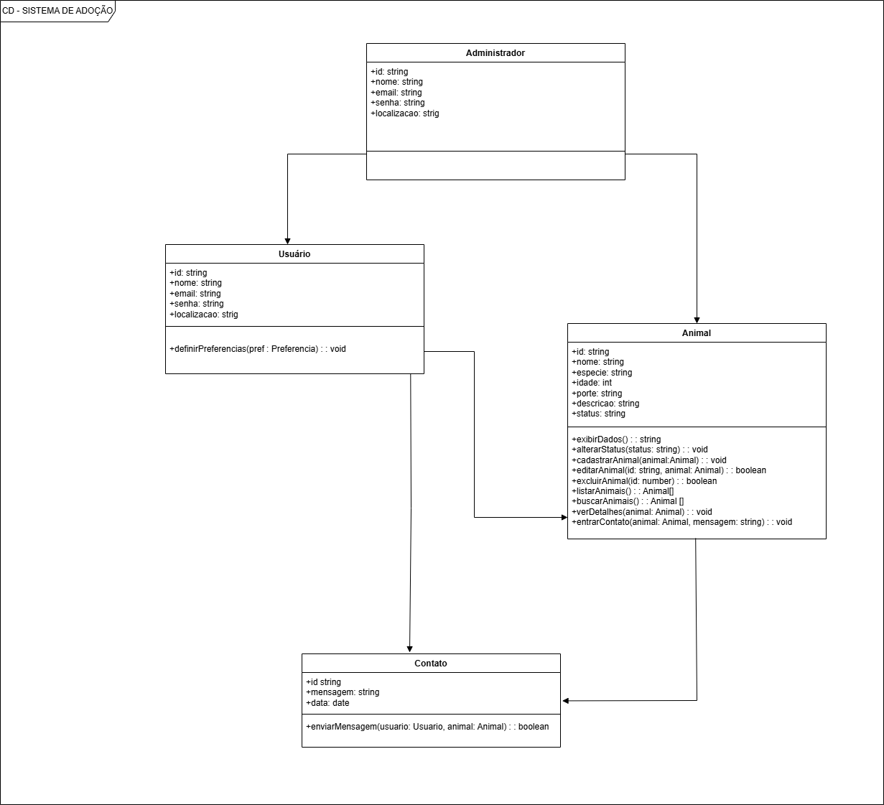

# [Amigo Fiel] – Equipe Isabel, Larissa, Suzana e Nathan

## Integrantes

| Nome | Matrícula | GitHub |
|------|-----------|--------|
| Isabel Schifler | 2024003899 | [@isabelschifler](https://github.com/isabelschifler) |
| Suzana Silveira | 2024002283 | [@SuzanaSilveira](https://github.com/SuzanaSilveira) |
| Larissa Damasceno | 2023009987 | [@lariiferraz](https://github.com/lariiferraz) |
| Nathan | 2023007991| [@Nathan](https://github.com/M1st3r2) |

---

## Descrição do projeto

O Amigo Fiel é uma plataforma web desenvolvida para facilitar e incentivar a adoção responsável de animais. O sistema conecta animais que aguardam por um lar a pessoas interessadas em adotar, promovendo transparência, segurança e eficiência no processo de adoção.

## Funcionalidades do Sistema

Para o administrador:

- Cadastrar, editar e gerenciar os animais disponíveis para adoção;

- Manter informações completas como: identificação (nome, espécie, porte, idade) e status de disponibilidade;

- Gerenciar solicitações de adoção e comunicar-se com os usuários   

Para o usuário interessado: 

- Visualizar todos os animais cadastrados com seus respectivos detalhes

- Acessar informações completas de cada animal (nome, idade, porte, etc.)

- Realizar contato com os responsáveis por meio de mensagens


## Modelagem do Sistema

Para representar o funcionamento do projeto Amigo Fiel, foram desenvolvidos diagramas UML que auxiliam na compreensão das funcionalidades e da estrutura do sistema. O diagrama de casos de uso apresenta as principais interações entre os atores e a plataforma. Nele, o ator Administrador possui responsabilidades como cadastrar conta, cadastrar animais, visualizar os animais cadastrados e editar ou excluir anúncios. Já o ator Usuário (adotante) pode definir preferências de busca, navegar entre os animais disponíveis e visualizar detalhes dos animais, além de entrar em contato com o responsável pelo anúncio. Essas funcionalidades representam o fluxo principal do sistema e demonstram como ocorre o processo de adoção dentro da plataforma.

Já o diagrama de classes representa a estrutura interna do sistema e os relacionamentos entre suas entidades principais: Administrador, Usuário, Animal e Contato. A classe Administrador é responsável pelo gerenciamento dos anúncios de adoção, enquanto a classe Usuário permite a navegação pelos animais disponíveis e a solicitação de adoção daqueles de seu interesse. A classe Animal armazena informações como nome, espécie, idade, porte, descrição, status e também poderá armazenar a imagem do animal. Por fim, a classe Contato gerencia a comunicação entre usuários interessados e responsáveis pelos animais. Essa modelagem contribui para uma melhor organização da aplicação e facilita futuras expansões e manutenções do sistema.


## Diagrama de Casos de Uso


## Diagrama de Classes



---

## Tecnologias utilizadas

- HTML5
- CSS3
- JavaScript (ES6+)
- Node.js
- Express.js
- SQLite
- Swagger (documentação da API)

As tecnologias escolhidas para o desenvolvimento do Amigo Fiel foram selecionadas por oferecerem praticidade, boa documentação e ampla utilização no desenvolvimento web. O JavaScript (ES6+) foi utilizado para implementar a lógica do sistema tanto no frontend quanto no backend. O HTML5 e o CSS3 foram escolhidos para estruturar e estilizar as páginas da aplicação, possibilitando a criação de uma interface intuitiva e responsiva. O Node.js foi utilizado como ambiente de execução do backend, permitindo o gerenciamento eficiente das requisições do sistema. Já o Express.js foi empregado para facilitar a criação da API REST e a organização das rotas da aplicação. O SQLite, juntamente com comandos SQL, foi definido para armazenar e gerenciar os dados de usuários, animais e contatos de forma segura e organizada. Além disso, o Swagger foi utilizado para documentar e testar os endpoints da API, contribuindo para a manutenção e validação das funcionalidades desenvolvidas.

## Aplicação do padrão MVC 

O sistema Amigo Fiel foi desenvolvido utilizando a arquitetura MVC (Model-View-Controller), que promove a separação das responsabilidades da aplicação. Os controllers são responsáveis pelo processamento das requisições e regras de negócio, os modelos representam as entidades do sistema, como Usuário e Animal, e as views correspondem às páginas HTML exibidas aos usuários. Essa organização torna o código mais modular, facilita a manutenção e permite a evolução do sistema de forma mais organizada.

## Estrutura de Rotas, Controllers e Views

Seguindo os conceitos estudados na disciplina sobre organização de aplicações web com Node.js e Express, o projeto Amigo Fiel foi estruturado com a separação de responsabilidades entre as camadas de rotas, controllers e views, adotando uma arquitetura inspirada no padrão MVC (Model-View-Controller). Essa abordagem contribui para a organização do sistema, facilitando sua manutenção e futura expansão.

As rotas são responsáveis por definir os caminhos de navegação e tratar as requisições HTTP, direcionando cada operação para o controller correspondente. Entre as principais rotas implementadas estão /login, /cadastro, /animais, /detalhes-animal, /perfil e /contato, permitindo a navegação entre as funcionalidades da plataforma de adoção.

Os controllers recebem as requisições encaminhadas pelas rotas, processam os dados e aplicam as regras de negócio da aplicação, como cadastro de usuários, autenticação de login, registro de animais para adoção, atualização de informações e gerenciamento de contatos entre adotantes e responsáveis.

Já as views representam a camada de apresentação do sistema, desenvolvida com HTML, CSS e JavaScript. Essa camada é responsável pela interface visual da aplicação, incluindo formulários, listagens de animais, páginas de detalhes e telas de cadastro.

Essa separação de responsabilidades torna o projeto mais organizado, escalável e de fácil manutenção, permitindo a inclusão de novas funcionalidades com menor impacto nas demais partes do sistema.

## Integração com APIs Externas

A API do projeto Amigo Fiel foi desenvolvida em Node.js com Express e organiza as principais funcionalidades do sistema por meio de endpoints REST.

Para animais, existem as rotas:

- GET /api/animais (listar todos)
- POST /api/animais (cadastrar)
- GET /api/animais/disponiveis (listar disponíveis)
- GET /api/animais/buscar/por-especie/{especie} (buscar por espécie)
- GET /api/animais/buscar/por-porte/{porte} (buscar por porte)
- GET /api/animais/{id} (buscar por ID)
- PUT /api/animais/{id} (atualizar)
- DELETE /api/animais/{id} (remover)

Para usuários, as rotas são:

- POST /api/usuarios/cadastro (cadastro)
- POST /api/usuarios/login (login)
- POST /api/usuarios/buscar-cep (consulta de CEP)
- GET /api/usuarios/{id} (buscar usuário)

A API utiliza JSON para troca de dados e segue o padrão REST para comunicação entre frontend e backend.

## Tratamento de Erros

O sistema Amigo Fiel conta com uma camada de tratamento de erros tanto no back-end quanto no front-end, seguindo as boas práticas abordadas na disciplina. No back-end, foi implementado um middleware de erro global que captura todas as exceções geradas durante o processamento das requisições, padronizando as respostas em JSON com mensagens claras e códigos de status HTTP apropriados. As rotas utilizam a função next(erro) para encaminhar os problemas ao middleware, permitindo diferenciar erros esperados, como validações e recursos não encontrados, de erros inesperados, como falhas no banco de dados. No front-end, as requisições à API tratam os status e as mensagens de erro retornadas, exibindo feedbacks visuais adequados para o usuário, como avisos em formulários e alertas sobre ações indevidas. Essa integração entre as camadas garante uma experiência mais confiável e facilita a manutenção do sistema.

## Integração com banco de dados

O sistema Amigo Fiel utiliza o SQLite com o driver better-sqlite3 para armazenar os dados de usuários, animais, preferências, contatos e recuperação de senha. O banco é composto por cinco tabelas: usuarios, com email único e tipo de usuário; animais, com status de disponibilidade; preferencias, para guardar as preferências de busca dos adotantes; contatos, para registrar mensagens dos interessados; e recuperacao_senha, para redefinição de senha. As tabelas são interligadas por chaves estrangeiras, como administrador_id em animais referenciando usuarios(id), garantindo a integridade dos dados. As operações são realizadas com queries parametrizadas usando prepare(), prevenindo injeção de SQL, e os controllers executam as consultas aplicando as regras de negócio da aplicação.

## Autenticação e autorização

O sistema Amigo Fiel implementa autenticação e autorização seguindo o modelo JWT (JSON Web Token), conforme abordado na disciplina. O fluxo de login gera um token codificado em Base64 contendo o ID e o email do usuário, que é armazenado no front-end e enviado no cabeçalho Authorization das requisições. O middleware adminMiddleware é responsável por validar esse token, consultar o banco de dados para confirmar a existência do usuário e verificar se ele possui o tipo "admin", retornando os status HTTP adequados: 401 (não autorizado) para tokens inválidos ou usuários não encontrados, e 403 (proibido) para usuários autenticados sem permissão de administrador. Esse middleware é aplicado nas rotas que exigem privilégios administrativos, garantindo que apenas usuários com perfil de administrador possam acessar funcionalidades restritas do sistema.

## Como executar o projeto

- Clone o repositório
git clone https://github.com/SuzanaSilveira/projeto-progII.git

- Acesse a pasta do projeto
cd projeto-progII

- Instale as dependências do back-end
cd backend
npm install

- Inicie o servidor
npm start

---

## Estrutura de pastas

```
projeto-progII/
│
├── backend/
│   ├── package.json            
│   ├── package-lock.json      
│   ├── .env                   
│   │
│   └── src/
│       ├── server.js           
│       │
│       ├── controladores/     
│       │   ├── animalController.js
│       │   └── usuarioController.js
│       │   └── adminController.js
│       │   └── authController.js
│       │   └── solicitacaoController.js
│       │   └── uploadController.js
│       │
│       ├── rotas/              
│       │   ├── Animal.js
│       │   └── Usuario.js
│       │   └── adminRoutes.js
│       │   └── authRoutes.js
│       │   └── solicitacaoRoutes.js
│       │   └── uploadRoutes.js
│       │
│       ├── database/           
│       │   ├── database.js
│       │   └── amigofiel.db
│       │   └── solicitacao.js
│       │
│       ├── middleware/
│       │   ├── adminMiddleware.js
│       │   └── uploadConfig.js
│
├── frontend/
│       ├── css/           
│       │   ├── cadastro-animal.css
│       │   └── cadastro.css
│       │   └── detalhes-animal.css
│       │   └── home.css
│       │   └── index.css
│       │   └── interesses.css
│       │   └── login.css
│       │   └── style.css
│       │   └── tela-admin.css
│       │
│       ├── js/
│       │   ├── cadastro-animal.js
│       │   └── cadastro.js
│       │   └── detalhes-animal.js
│       │   └── home.css
│       │   └── index.js
│       │   └── interesses.js
│       │   └── login.js
│       │   └── tela-admin.js
│       │
│       ├── pages/
│       │   ├── cadastro-animal.html
│       │   └── cadastro.html
│       │   └── detalhes-animal.html
│       │   └── home.html 
│       │   └── index.html
│       │   └── interesses.html
│       │   └── login.html
│       │   └── tela-admin.html
│       │
├── uploads/
|
└── .gitignore                  
```

---

## Histórico de entregas

| Entrega | Descrição | Data | Status |
|---------|-----------|------|--------|
| E1 | Definição do projeto | 06/04/2026 | ✅  |
| E2 | Modelagem | 10/04/2026 | ✅ |
| E3 | Backend + BD | 15/04/2026 |  ✅ |
| E4 | Interface integrada | 15/06/2026 | ✅ |
| E5 | Projeto final | — | ⏳ |

> ⏳ Pendente | ✅ Concluído | 🔄 Em andamento
